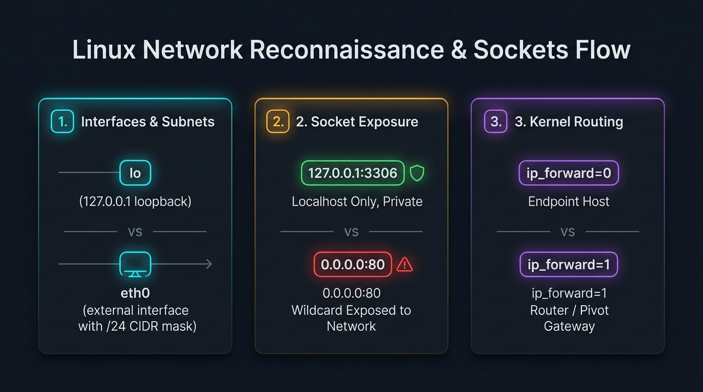

# 🌐 Mini Project #2: Linux Network Information & Reconnaissance Tool

> **Phase 1: Linux Fundamentals — Hands-on Learning Project**  
> *"Before an attacker pivots or a defender investigates, both must understand the battlefield: the network stack."*

---

## 🎯 Learning Objectives

By completing and studying this project, you will learn:
1. **Host Situational Awareness:** Why network reconnaissance is the first phase of post-exploitation for Red Teams and triage for Blue Teams.
2. **Modern Linux Network Stack:** Why `iproute2` (`ip`, `ss`) replaced legacy `net-tools` (`ifconfig`, `netstat`).
3. **Addressing & Routing:** How the Linux kernel handles interfaces (`eth0`, `lo`, `tun0`), CIDR notation, and route lookups to the default gateway.
4. **DNS Resolution Hierarchy:** How Linux resolves domains using `/etc/resolv.conf`, `systemd-resolved` (127.0.0.53 stub), and search domains.
5. **Sockets & Listening Ports:** The difference between `0.0.0.0` (wildcard/public) and `127.0.0.1` (loopback/internal) binding, socket states, and privilege boundaries.
6. **Security & Pivoting Indicators:** Detecting promiscuous sniffing interfaces, active IP forwarding, and internal services vulnerable to SSRF or privilege escalation.

---

## 🧠 Core Theory & Security Concepts



### 1. Network Interfaces & IP Addressing
A Linux machine communicates through virtual or physical **interfaces**:
* `lo` (Loopback): `127.0.0.1` (IPv4) or `::1` (IPv6). Traffic never leaves the local machine.
* `eth0` / `ens33` / `enp0s3`: Ethernet physical/virtual adapters.
* `wlan0`: Wireless interface.
* `docker0` / `br-*`: Virtual bridge interfaces created by Docker/containers.
* `tun0` / `tap0`: Virtual tunnel interfaces created by VPNs (OpenVPN, WireGuard).

```bash
# Modern command:
ip -brief address show
# Displays: Interface | State (UP/DOWN) | IPv4 & IPv6 with CIDR (e.g. 192.168.1.50/24)
```

> **Why CIDR `/24` matters:** `/24` means 24 bits are dedicated to the network prefix (`255.255.255.0`), leaving 8 bits for 254 usable host addresses (`.1` to `.254`). When an attacker discovers an IP like `10.10.10.15/24`, they immediately know their target scope for subnet scanning is `10.10.10.1` through `10.10.10.254`.

---

### 2. Default Gateway & Routing Table
When a computer wants to send a packet to an IP outside its local subnet (e.g., reaching Google at `8.8.8.8`), it looks up its **routing table**:
```bash
ip route show
# Example output:
# default via 192.168.1.1 dev eth0 proto dhcp metric 100
# 192.168.1.0/24 dev eth0 proto kernel scope link src 192.168.1.50 metric 100
```
* **Direct Route (`192.168.1.0/24 dev eth0`):** Any packet within this range is resolved directly via ARP without passing through a router.
* **Default Route (`default via 192.168.1.1`):** Any destination not matching a local subnet is forwarded to `192.168.1.1` (the router/firewall).

> 🔴 **Attacker Context:** If an attacker compromises a host with *multiple* routing entries or multiple interfaces on different subnets (e.g., `192.168.1.0/24` and `10.0.0.0/16`), they have found a **dual-homed pivot point**! This allows them to route traffic into an otherwise isolated internal corporate segment.

---

### 3. DNS Resolution (`/etc/resolv.conf`)
Domain name resolution translates human names (`target.corp`) into IP addresses.
* `/etc/resolv.conf` contains the nameservers queried by the system resolver:
  ```text
  nameserver 127.0.0.53
  search corp.internal
  ```
* **Why `127.0.0.53`?** Modern systemd-based distributions run a local DNS caching stub called `systemd-resolved`. Query `resolvectl status` or `resolvectl dns` to see the actual upstream DNS servers assigned by DHCP.

> 🔴 **Attacker Context:** Finding internal search domains (e.g. `corp.internal`, `lab.local`) leaks the Active Directory domain name or internal DNS zone, enabling internal DNS zone transfers or LLMNR/NBT-NS spoofing attacks.

---

### 4. Listening Sockets & Open Ports (`ss` vs `netstat`)
Sockets represent network communication endpoints. When a server program (like Apache, MySQL, or SSH) is ready to accept connections, it creates a socket and calls `bind()` and `listen()`.

```bash
ss -tulnp
```
* `-t`: Show **TCP** sockets.
* `-u`: Show **UDP** sockets.
* `-l`: Show only **listening** sockets (services waiting for connections).
* `-n`: Show **numeric** ports instead of resolving service names (e.g. `22` instead of `ssh`). *Always use `-n` in pentesting/scripting for speed and to avoid alerting DNS logs!*
* `-p`: Show the **process** name and PID that opened the socket (requires `sudo` or root).

#### Critical Distinction: Bind Addresses
| Local Address | Meaning | Security Implication |
|---|---|---|
| `0.0.0.0:80` | Wildcard / All interfaces | Accessible to anyone on the network (publicly exposed). |
| `127.0.0.1:3306` | Loopback only | Only processes running on the *same machine* can connect. |
| `192.168.1.50:8080` | Specific interface | Only accessible through the `192.168.1.x` subnet. |

> 🔴 **Attacker Context (Privilege Escalation / SSRF):**  
> If an attacker finds MySQL (`3306`) or an internal admin API listening on `127.0.0.1:8080`, external port scanners like Nmap will show the port as **closed**! But from inside the compromised machine (or via an SSRF vulnerability), the attacker can access it directly to escalate privileges.

---

### 5. Security & Pivoting Flags

#### A. IP Forwarding (`/proc/sys/net/ipv4/ip_forward`)
* Value `0`: The kernel drops packets whose destination IP is not its own.
* Value `1`: The kernel routes packets between different interfaces. If enabled, the system can function as a router, VPN gateway, or pivot point for traffic tunneling.

#### B. Promiscuous Mode (`PROMISC`)
* Normal mode: Network cards ignore frames whose destination MAC address does not match their own.
* Promiscuous mode: The card captures *every* packet on the physical/virtual wire. This usually indicates an active network sniffer (Wireshark, `tcpdump`), an IDS (Suricata), or an attacker running ARP poisoning.

---

## 🛠️ Included Tools

This directory contains two production-quality implementations:

| File | Language | Highlights |
|---|---|---|
| [`netinfo.sh`](file:///e:/my_projects/hack/phase-01-linux-fundamentals/03-mini-projects/net-info-tool/netinfo.sh) | Pure Bash | Lightweight, zero external dependencies, ANSI color output, automated security checks. |
| [`netinfo.py`](file:///e:/my_projects/hack/phase-01-linux-fundamentals/03-mini-projects/net-info-tool/netinfo.py) | Python 3 | Cross-platform, detailed structure, supports `--json` export for security pipelines. |

---

## 🚀 How to Run & Practice

### Running the Bash Script
```bash
# Make executable
chmod +x netinfo.sh

# Run directly
./netinfo.sh

# Run with sudo to see process names and PIDs for all listening ports
sudo ./netinfo.sh
```

### Running the Python Script
```bash
# Standard human-readable console report
python3 netinfo.py

# JSON output (ideal for piping to jq or saving to audit files)
python3 netinfo.py --json

# Example: Extract only listening port addresses using jq
python3 netinfo.py --json | jq '.listening_ports[].local_address'
```

---

## 🧪 Hands-On Learning Exercises

Try executing these manual commands in your Linux or WSL terminal to verify the concepts:

1. **Find all IP addresses and states:**
   ```bash
   ip -brief address show
   ```
2. **Find the default gateway:**
   ```bash
   ip route show default
   ```
3. **Inspect DNS configuration:**
   ```bash
   cat /etc/resolv.conf
   ```
4. **List all listening TCP ports with their process names:**
   ```bash
   sudo ss -tlpn
   ```
5. **Check if IP forwarding is enabled:**
   ```bash
   sysctl net.ipv4.ip_forward
   # or
   cat /proc/sys/net/ipv4/ip_forward
   ```

---

## 📝 Summary Checklist

- [x] Network interfaces & MAC address enumeration
- [x] IPv4 & IPv6 CIDR parsing
- [x] Default gateway & routing table analysis
- [x] DNS resolver & domain search enumeration
- [x] Listening sockets & open port discovery (`ss -tulnp`)
- [x] Active established connections detection
- [x] Localhost vs Wildcard binding security checks
- [x] IP Forwarding & Promiscuous mode detection
