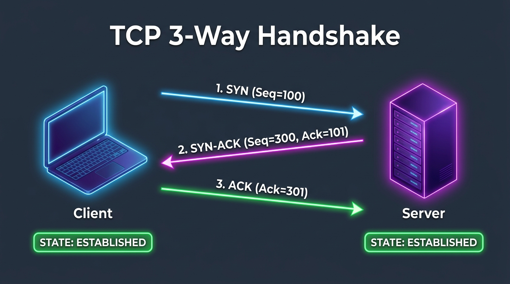
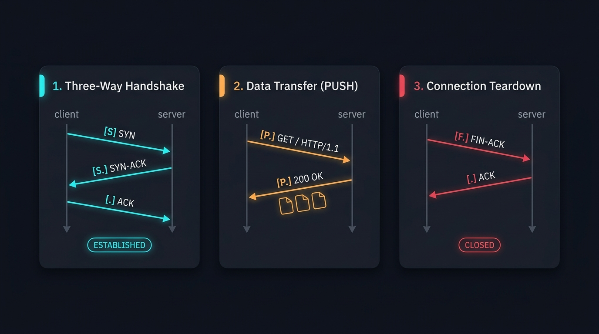

# 🔌 Step 1: TCP/UDP & The 3-Way Handshake

> **Phase 2: Networking — On The Wire**  
> *"Before data moves, a conversation must be established."*

---

## 1. TCP vs. UDP: The Core Distinction

| Feature | TCP (Transmission Control Protocol) | UDP (User Datagram Protocol) |
| :--- | :--- | :--- |
| **Reliability** | **Guaranteed:** Every packet is acknowledged; missing packets are retransmitted. | **Best Effort:** Packets are sent with no guarantee of delivery or ordering. |
| **Connection** | **Connection-Oriented:** Requires a 3-way handshake (`SYN` $\rightarrow$ `SYN-ACK` $\rightarrow$ `ACK`). | **Connectionless:** Directly sends datagrams with no pre-arranged state. |
| **Speed** | Slightly slower due to headers, acknowledgments, and flow control. | Very fast with minimal overhead (only an 8-byte header). |
| **Use Cases** | Web browsing (HTTP/HTTPS), SSH, File transfers (FTP/SFTP), Databases. | Video streaming, Voice/VoIP (Discord), Online gaming, DNS queries. |

---

## 2. The TCP 3-Way Handshake Flow

Before two computers exchange application data (like a webpage), they synchronize sequence numbers:



### Handshake Sequence:
1. **`SYN` (Synchronize):**  
   The client sends a packet with flag `[S]` proposing a starting sequence number (e.g. `Seq=100`).
2. **`SYN-ACK` (Synchronize-Acknowledge):**  
   The server acknowledges with flag `[S.]`, expecting the next byte (`Ack=101`), and proposes its own sequence number (`Seq=300`).
3. **`ACK` (Acknowledge):**  
   The client confirms with flag `[.]` (`Ack=301`).  
   👉 **Both sides transition to `ESTABLISHED` state!**

---

## 3. The Complete TCP Lifecycle

A full TCP conversation consists of three distinct phases:



1. **The Handshake:** Establishes agreement and state (`[S]` $\rightarrow$ `[S.]` $\rightarrow$ `[.]`).
2. **Data Transfer (PUSH):** The application sends real data with flag `[P.]` (e.g. `GET / HTTP/1.1`).  
   *Every data packet receives an empty delivery receipt `[.]` (`length 0`) from the other side!*
3. **Connection Teardown:** When finished, both sides politely close the connection with flag `[F.]` (`FIN`).

---

## 4. The 5 Core TCP Flags

| Flag Symbol | Real Name | Meaning & Purpose |
| :---: | :--- | :--- |
| **`[S]`** | **SYN** | "Synchronize sequence numbers; let's start a connection." |
| **`[.]`** | **ACK** | "Acknowledge; I received your data/packet." |
| **`[P]`** | **PSH** (Push) | "Push this data immediately to the application (don't wait for buffers)." |
| **`[F]`** | **FIN** | "Finish; I have no more data to send, let's close gracefully." |
| **`[R]`** | **RST** (Reset) | "Connection refused or error; terminate socket immediately!" |

---

## 5. Live Capture with `tcpdump`

You can watch these exact flags in real-time on your own machine:

```bash
# Sniff TCP packets on port 8080:
sudo tcpdump -i lo -nn "port 8080"
```

### Real Capture Output Breakdown:
```text
# 1. Client knocks: SYN
01:40:41 IP 127.0.0.1.48110 > 127.0.0.1.8080: Flags [S], seq 473064288

# 2. Server answers: SYN-ACK
01:40:41 IP 127.0.0.1.8080 > 127.0.0.1.48110: Flags [S.], seq 3404464429, ack 473064289

# 3. Client confirms: ACK (Connection ESTABLISHED)
01:40:41 IP 127.0.0.1.48110 > 127.0.0.1.8080: Flags [.], ack 1

# 4. Client sends HTTP GET Request: PUSH
01:40:41 IP 127.0.0.1.48110 > 127.0.0.1.8080: Flags [P.], seq 1:79, ack 1: HTTP: GET / HTTP/1.1

# 5. Server confirms receipt: ACK (empty receipt)
01:40:41 IP 127.0.0.1.8080 > 127.0.0.1.48110: Flags [.], ack 79, length 0

# 6. Server replies with Webpage: PUSH
01:40:41 IP 127.0.0.1.8080 > 127.0.0.1.48110: Flags [P.], seq 1:157, ack 79: HTTP: HTTP/1.0 200 OK

# 7. Server closes its side: FIN
01:40:41 IP 127.0.0.1.8080 > 127.0.0.1.48110: Flags [F.], seq 810, ack 79

# 8. Client closes its side: FIN
01:40:41 IP 127.0.0.1.48110 > 127.0.0.1.8080: Flags [F.], seq 79, ack 811
```

---

## 6. 🔴 Offensive & Defensive Takeaways

### A. How Nmap Discovers Port States
When scanning target machines, security tools analyze the response to a `SYN` packet:
- **`[S.]` (SYN-ACK) received:** Port is **OPEN** (Service is listening).
- **`[R.]` (RST-ACK) received:** Port is **CLOSED** (OS kernel rejected connection).
- **No response (Timeout):** Port is **FILTERED** (Firewall dropped packet silently).

### B. The SYN Stealth Scan (`nmap -sS`)
Attackers send `SYN`. If the target replies `SYN-ACK`, the attacker sends a `RST` instead of completing the handshake with `ACK`. This prevents the application from logging a completed connection!

### C. The SYN Flood Attack (DoS)
Attackers flood a server with millions of spoofed `SYN` packets without sending `ACK`. The server wastes RAM holding "half-open" connection slots until it runs out of memory and crashes. Modern servers defend against this using **SYN Cookies**.
