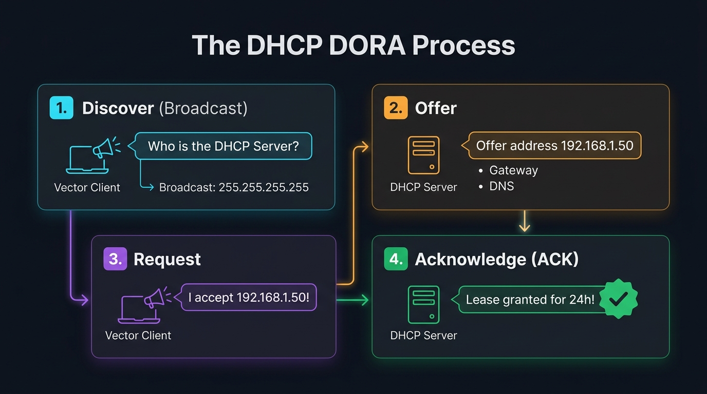
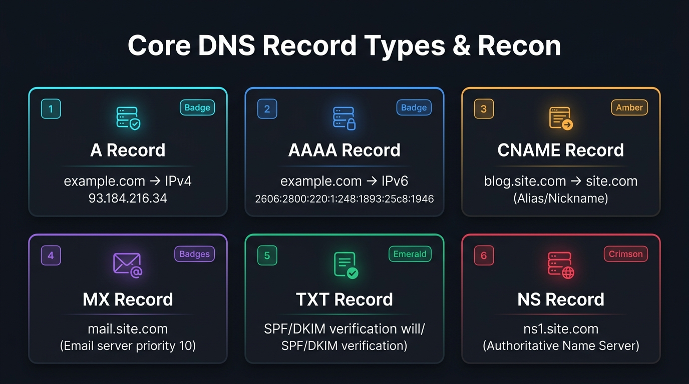
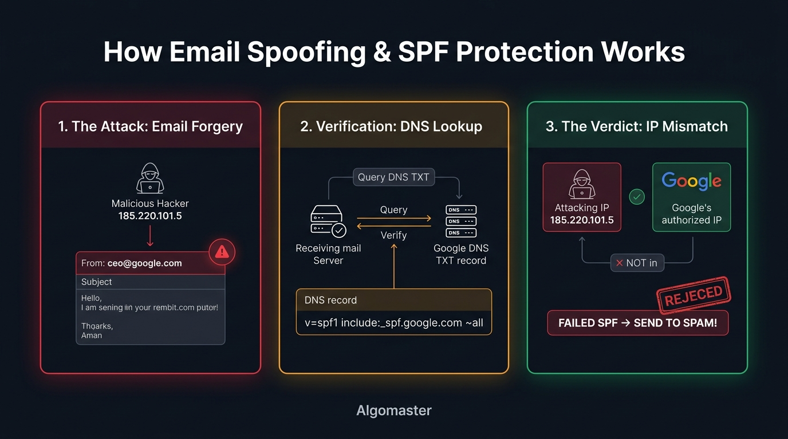
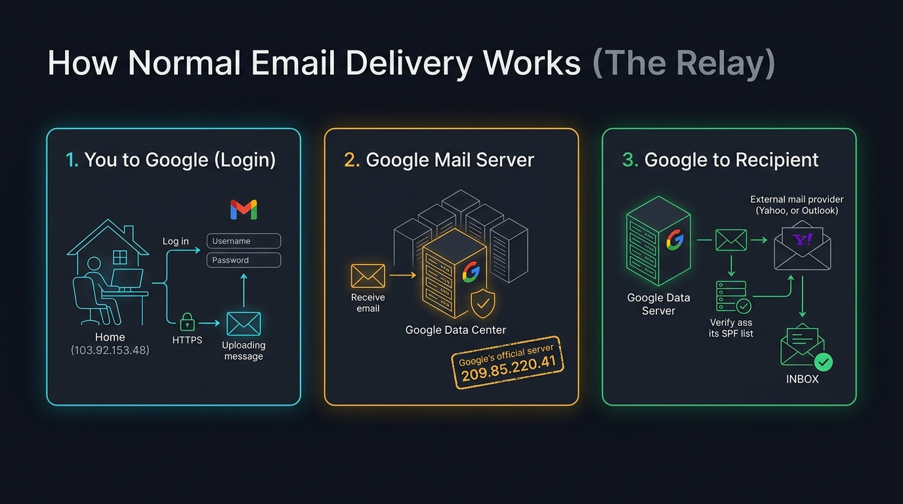

# 📡 Step 2: DHCP Auto-Configuration & DNS Record Reconnaissance

> **Phase 2: Networking — On The Wire**  
> *"Before a device can communicate, it must obtain network parameters and resolve names."*

---

## 1. How Devices Bootstrap: The DHCP DORA Process

When a computer joins a network (plugs into Ethernet or connects to Wi-Fi), it starts with:
- **No IP Address** (source: `0.0.0.0`)
- **No Subnet Mask**
- **No Default Gateway**
- **No DNS Nameserver**

It runs the **4-step DORA flow** over UDP ports `67` (server) and `68` (client):



### The DORA Sequence:
1. **Discover (`D`):**  
   Client sends a broadcast packet to `255.255.255.255` shouting:  
   👉 *"I am a new device! Who is the DHCP server? I need an IP address!"*
2. **Offer (`O`):**  
   The router/DHCP server hears the broadcast and replies with an offer:  
   👉 *"I can lease you `192.168.1.50`, subnet `/24`, gateway `192.168.1.1`, and DNS `1.1.1.1`."*
3. **Request (`R`):**  
   Client formally accepts:  
   👉 *"I accept your offer! Please reserve `192.168.1.50` for my MAC address."*
4. **Acknowledge (`A`):**  
   Server confirms:  
   👉 *"Lease granted for 24 hours! You are now configured."*

---

### 🔴 Offensive Security Risks in DHCP

1. **Rogue DHCP Server Attack (Instant MITM):**  
   Because DHCP Discover is an unauthenticated broadcast, an attacker on the same Wi-Fi can reply faster than the real router with an **Offer** listing the *attacker's machine* as the Default Gateway and DNS server! All victim traffic is instantly routed through the attacker without needing ARP spoofing.
2. **DHCP Starvation Attack (DoS):**  
   Attackers send thousands of fake DHCP Discover packets with randomized MAC addresses, exhausting all available IP addresses in the pool. Real devices can no longer join the network.
3. **Defense — DHCP Snooping:**  
   Enterprise network switches only allow DHCP Offers from **Trusted Ports** (where the legitimate router is connected) and drop rogue DHCP replies on all user-facing ports.

---

## 2. The Core DNS Record Types

Once configured with a DNS server, the client resolves domains using specific record types:



| Record Type | Mapping | Security & Recon Purpose |
| :---: | :--- | :--- |
| **`A`** | `domain` $\rightarrow$ **IPv4** | Locates server IP to scan for vulnerabilities with Nmap. |
| **`AAAA`** | `domain` $\rightarrow$ **IPv6** | IPv6 bypass: many firewalls only filter IPv4, leaving IPv6 exposed. |
| **`CNAME`** | `alias` $\rightarrow$ `canonical domain` | **Subdomain Takeovers:** if a CNAME points to an unclaimed AWS S3/GitHub page, attackers can hijack the subdomain. |
| **`MX`** | `domain` $\rightarrow$ **Mail Server** | Email recon: identifies mail providers (Google Workspace, Office 365, internal servers). |
| **`TXT`** | `domain` $\rightarrow$ **Text Strings** | **SPF/DKIM/DMARC:** anti-spoofing policies. Also leaks third-party SaaS vendors used by the organization. |
| **`NS`** | `domain` $\rightarrow$ **Name Server** | Identifies the authoritative DNS provider (Cloudflare, AWS Route53). |

---

## 3. Live DNS Reconnaissance with `dig`

Linux provides **`dig`** (Domain Information Groper) to query DNS records directly:

### 1. Query IPv4 Address (`A` Record)
```bash
dig google.com A +short
# Output: 142.250.190.46
```

### 2. Query Mail Servers (`MX` Record)
```bash
dig google.com MX +short
# Output: 10 smtp.google.com. (10 = priority preference)
```

### 3. Inspect Security Policies & Vendor Verification (`TXT` Record)
```bash
dig google.com TXT +short
# Reveals SPF anti-spoofing: "v=spf1 include:_spf.google.com ~all"
# Reveals third-party tools: DocuSign, Apple, Cisco, Facebook, OneTrust
```

---

## 4. Deep-Dive: Email Spoofing & The SPF Defense

### A. How Attackers Forged Emails (The SMTP Flaw)
Email protocols (SMTP) do not verify sender identity by default. An attacker could send an email with `From: ceo@google.com` directly from their own laptop.



When the receiving server checks Google's DNS `TXT` SPF record, it discovers the attacker's IP is **not** authorized and rejects the email to Spam!

### B. How Normal Users Send Emails (The Relay Architecture)
A normal user never sends emails directly to the recipient's mail server. Instead, they authenticate with Google, and **Google's authorized servers relay the email**:



Because Google authenticates you first, only Google's official IP addresses (which match the SPF list) deliver the message to the recipient!

