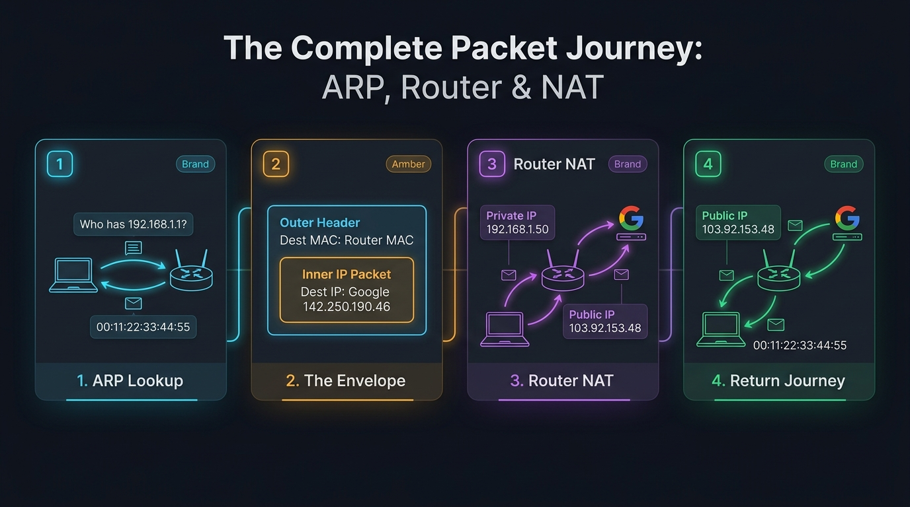

# 🛣️ Step 3: The Complete Packet Journey: ARP, Routing & NAT

> **Phase 2: Networking — On The Wire**  
> *"IP gets the packet across the planet; MAC gets it across the room."*

---

## 1. The 4-Stage Packet Journey

Here is the complete visual breakdown of how your machine sends a packet to an outside server (like Google) and gets the response back:



---

### Step 1: The ARP Lookup (`ip neigh`)
Your machine knows Google's IP (`142.250.190.46`), but your routing table says:  
👉 *"Google is outside! Send this packet to the Default Gateway (`192.168.1.1`)."*

To talk to the router across the physical/virtual wire, your computer needs the router's **hardware MAC address**:
- Your machine shouts an **ARP Request**: *"Who has IP 192.168.1.1? Tell me your MAC!"*
- The router replies: *"I have 192.168.1.1! My MAC address is `00:11:22:33:44:55`."*
- Your machine saves this in its ARP table (`ip neigh`) so it doesn't need to ask again.

---

### Step 2: The Envelope (Layer 2 vs. Layer 3)
Your computer packages the data inside two layers:

```text
┌────────────────────────────────────────────────────────┐
│ OUTER ENVELOPE (Layer 2 - Ethernet Frame):             │
│   Source MAC:      [Your Laptop MAC]                   │
│   Destination MAC: [THE ROUTER'S MAC]                  │
│                                                        │
│   ┌──────────────────────────────────────────────────┐ │
│   │ INNER LETTER (Layer 3 - IP Packet):              │ │
│   │   Source IP:      192.168.1.50 (Your Private IP) │ │
│   │   Destination IP: 142.250.190.46 (Google)        │ │
│   │                                                  │ │
│   │   [Payload: "GET / HTTP/1.1"]                    │ │
│   └──────────────────────────────────────────────────┘ │
└────────────────────────────────────────────────────────┘
```

- **Destination IP:** Google (`142.250.190.46`) — **This NEVER changes across the entire planet!**
- **Destination MAC:** Router (`00:11:22:33:44:55`) — Tells the physical switch to hand this envelope to the router.

---

### Step 3: Router NAT (Network Address Translation)
The router receives the frame because its own MAC address is on the outside:
1. It strips the outer Layer 2 envelope.
2. It looks at the inner IP: *"Oh, this is addressed to Google!"*
3. Because private IPs (`192.168.x.x`) cannot travel on the public internet, the router performs **NAT**:
   - Swaps Private Source IP `192.168.1.50` $\rightarrow$ **Router's Public IP (`103.92.153.48`)**.
   - Records the port in its internal NAT table: *"Connection started by laptop on port 54321."*
4. Sends the packet across the global internet to Google!

---

### Step 4: The Return Journey
Google replies back to your public IP:
1. The response packet arrives at your router: `Destination: 103.92.153.48`.
2. The router checks its NAT table:  
   👉 *"Ah! This return packet belongs to laptop `192.168.1.50` on port 54321!"*
3. The router swaps the destination back to `192.168.1.50`.
4. The router creates a new Layer 2 envelope addressed to **Your Laptop's MAC address**.
5. Hands the packet to your laptop $\rightarrow$ delivered to Chrome/Python $\rightarrow$ page renders!

---

## 2. 🔴 Offensive & Defensive Takeaways

### A. The ARP Spoofing Flaw (Layer 2 MITM)
ARP has no passwords or authentication. An attacker can send unsolicited ARP replies to your laptop claiming:  
*"I am 192.168.1.1! My MAC is AA:BB:CC:DD:EE:FF (Attacker MAC)!"*
- Your laptop will stamp the **Attacker's MAC** as the destination envelope.
- All your outbound traffic flies straight into the attacker's machine before reaching the real router.

### B. Why Destination MAC Changes at Every Hop, but IP Does Not
- **MAC addresses** are local: they only exist between two devices connected to the same switch/cable. At every router hop across the internet, the outer MAC address is thrown away and replaced.
- **IP addresses** are global: they define the ultimate source and final destination of the packet.
