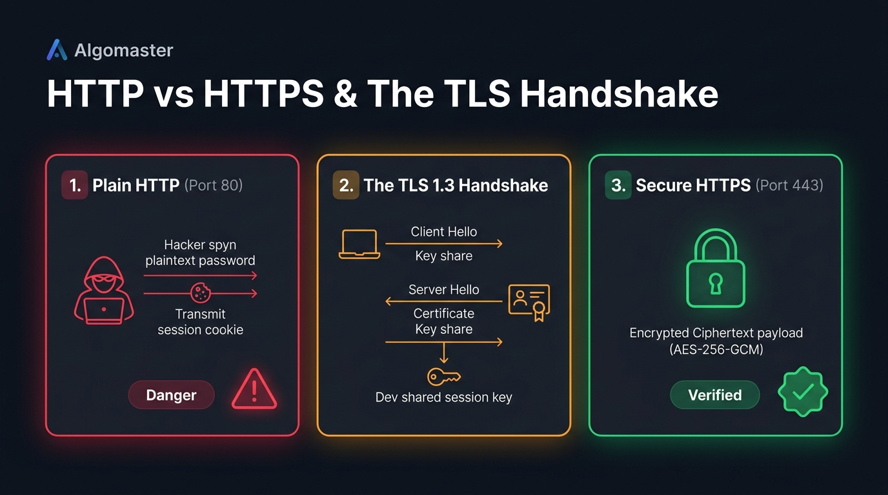
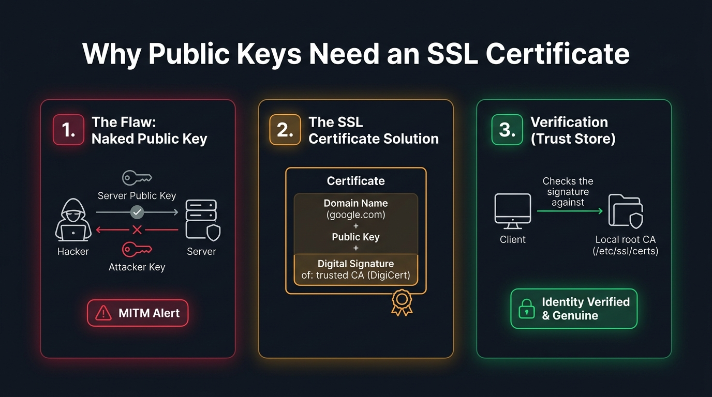

# 🔐 Step 4: HTTP vs. HTTPS & The TLS 1.3 Handshake

> **Phase 2: Networking — On The Wire**  
> *"Encryption is the shield that makes hostile networks safe for private data."*

---

## 1. HTTP vs. HTTPS Overview

| Feature | HTTP (HyperText Transfer Protocol) | HTTPS (HTTP Secure) |
| :--- | :--- | :--- |
| **Default Port** | Port **80** | Port **443** |
| **Encryption** | **None (Plaintext).** Anyone sniffing the network can read passwords, session cookies, and sensitive data. | **End-to-End Encryption.** All headers, URLs, cookies, and data are encrypted with TLS. |
| **Integrity** | Vulnerable to tampering and packet injection on the wire. | Tamper-proof: cryptographic Message Authentication Codes (MAC) detect any modification. |
| **Authentication** | No identity verification: anyone can pretend to be the server. | Authenticated via digital certificates signed by trusted Certificate Authorities (CAs). |

---

## 2. The TLS 1.3 Handshake Flow

Before any HTTP request or password is sent, the client and server negotiate encryption:



### Handshake Sequence:
1. **Client Hello:**  
   The client knocks on port 443 proposing supported ciphers (e.g. `TLS_AES_256_GCM_SHA384`) and sends a mathematical **Diffie-Hellman Key Share**.
2. **Server Hello & Certificate:**  
   The server agrees, sends its own Key Share, and provides its **Digital Certificate** signed by a trusted CA (e.g. Google Trust Services, DigiCert, Let's Encrypt).
3. **Deriving the Shared Session Key:**  
   Both machines combine key shares using Diffie-Hellman math. Both calculate the **exact same symmetric encryption key** without ever sending the key across the wire!
4. **Encrypted Communication:**  
   The socket transitions to encrypted mode. All subsequent data travels as **AES-256-GCM ciphertext**.

---

## 2.1. Why Send an SSL Certificate Instead of Just a Public Key?

A common question is: *"Why can't the server just send its public key directly to the client without a certificate?"*

Here is the fundamental cryptographic problem:



### The 3 Core Principles:
1. **Card 1 — The Naked Public Key Flaw (Identity Blindness):**  
   A public key by itself has **no proof of ownership**. If a client connects to `bank.com` and an attacker on the same Wi-Fi (via ARP spoofing) intercepts the traffic, the attacker can swap `bank.com`'s public key with **Attacker Public Key**. The client would encrypt passwords for the attacker without knowing!
2. **Card 2 — The Certificate as a Notarized Passport:**  
   An SSL Certificate solves this by acting as a sealed identity container:
   $$\text{Certificate} = \text{Domain Name } (\texttt{google.com}) + \text{Server's Public Key} + \text{CA Digital Signature}$$
   A globally trusted Certificate Authority (like DigiCert or Google Trust Services) cryptographically signs this package.
3. **Card 3 — Local Trust Store Verification:**  
   The client does not have to trust the server. The client checks the digital signature against its pre-installed **Root CA Trust Store** (`/etc/ssl/certs/ca-certificates.crt`). An attacker cannot forge this signature without stealing the CA's private key. If the signature or domain doesn't match, the connection is instantly rejected!

---

## 3. Real-World Terminal Inspection with `curl -v`

Running `curl -v -I https://google.com` displays the exact TLS negotiation:

```text
# 1. TCP Handshake complete on port 443
* Connected to google.com (142.251.223.238) port 443 (#0)

# 2. Local CA Trust Store loaded
*  CAfile: /etc/ssl/certs/ca-certificates.crt

# 3. Client Hello sent
* TLSv1.3 (OUT), TLS handshake, Client hello (1):

# 4. Server Hello & Certificate received
* TLSv1.3 (IN), TLS handshake, Server hello (2):
* TLSv1.3 (IN), TLS handshake, Certificate (11):
* TLSv1.3 (IN), TLS handshake, CERT verify (15):

# 5. Handshake complete! Cipher agreed upon
* SSL connection using TLSv1.3 / TLS_AES_256_GCM_SHA384

# 6. Certificate validated
* Server certificate:
*  subject: CN=*.google.com
*  issuer: C=US; O=Google Trust Services; CN=WE2
*  SSL certificate verify ok.

# 7. Encrypted HTTP/2 application traffic begins!
> HEAD / HTTP/2
> Host: google.com
< HTTP/2 301
```

---

## 4. Deconstructing the Cipher Suite

Look at the negotiated cipher:
```text
TLS_AES_256_GCM_SHA384
```
- **`TLS`:** Protocol family.
- **`AES_256_GCM`:** Bulk encryption algorithm:
  - **AES (Advanced Encryption Standard)** with a **256-bit** key (military-grade symmetric encryption).
  - **GCM (Galois/Counter Mode)**: An Authenticated Encryption mode providing both secrecy and integrity.
- **`SHA384`:** Cryptographic hash function used for verifying key derivation.

---

## 5. 🔴 Offensive & Defensive Security Takeaways

### A. Why MITM Attacks Fail Against HTTPS (The Red Warning Screen)
If an attacker performs ARP spoofing on a user visiting `https://bank.com`:
- The attacker cannot read the encrypted traffic.
- If the attacker attempts to intercept by pretending to be `bank.com`, the attacker must present an SSL certificate.
- Because the attacker does **not** have a certificate signed by a trusted Certificate Authority (CA) for `bank.com`, the victim's browser immediately halts and displays:
  ```text
  ⚠️ Your connection is not private!
  NET::ERR_CERT_AUTHORITY_INVALID
  ```

### B. How Security Tools Inspect HTTPS (Burp Suite / Corporate Proxies)
When you conduct authorized web application penetration testing using **Burp Suite**:
- You must manually install Burp Suite's root CA certificate into your browser's trust store (`/etc/ssl/certs`).
- Once installed, the browser trusts Burp Suite to decrypt, inspect, and re-encrypt HTTPS traffic on the fly!
