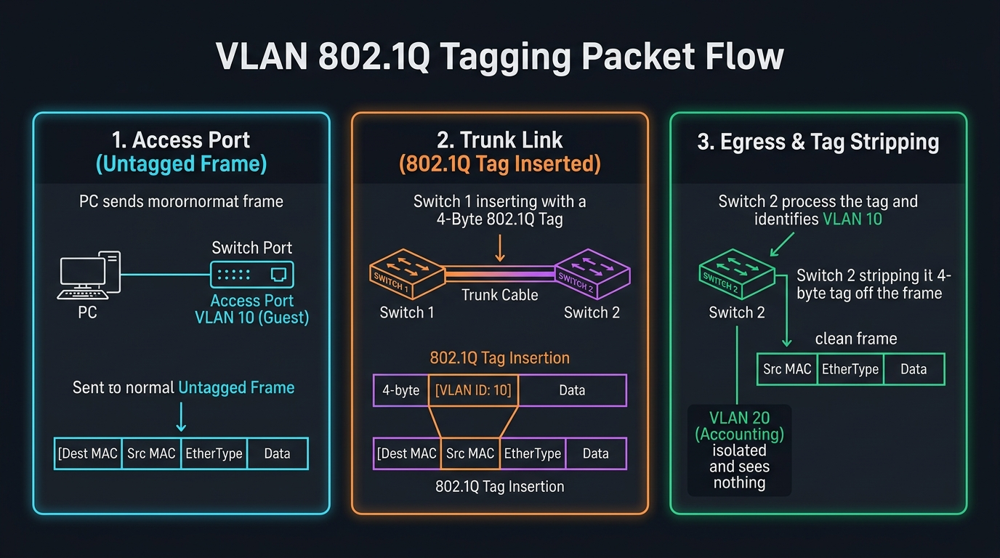

# 🌐 Step 5: VLANs, 802.1Q Tagging & Network Segmentation

> **Phase 2: Networking — On The Wire**  
> *"Segmentation ensures that compromising a guest Wi-Fi printer does not grant instant access to the core database."*

---

## 1. Why VLANs? (Broadcast Domain Isolation)

In a traditional flat Ethernet network:
- Every device plugged into a switch is in the **same broadcast domain**.
- If a guest sends an ARP request (`Who has 192.168.1.1?`), **every computer in the building** receives and processes that broadcast frame.
- Any rogue user on the guest Wi-Fi can run `arpspoof` or `wireshark` to sniff unencrypted traffic and attack other machines.

**A VLAN (Virtual Local Area Network)** partitions a single physical switch into multiple virtual broadcast domains:

| VLAN ID | Name | Subnet | Allowed Access |
| :--- | :--- | :--- | :--- |
| **VLAN 10** | Guest Wi-Fi | `192.168.10.0/24` | Internet only; completely isolated from internal systems. |
| **VLAN 20** | Accounting | `192.168.20.0/24` | Payroll, QuickBooks, Financial records. |
| **VLAN 30** | IT & Management | `192.168.30.0/24` | Domain Controllers, SSH jump hosts, Core servers. |

Devices in **VLAN 10 cannot talk to VLAN 20** at Layer 2. To communicate, traffic **must** pass through a Layer 3 firewall or router where security rules inspect the packets.

---

## 2. Access Ports vs. Trunk Ports

To understand how VLANs work on the wire, switches distinguish two types of ports:

```text
       ┌───────────┐
       │   PC A    │ (VLAN 10)
       └─────┬─────┘
             │ (Access Port: Untagged frame)
             ▼
      ┌──────────────┐                       ┌──────────────┐
      │   Switch 1   ├───────────────────────┤   Switch 2   │
      └──────────────┘      Trunk Cable      └──────┬───────┘
                        (802.1Q Tagged Frame)       │ (Access Port: Untagged frame)
                                                    ▼
                                             ┌───────────┐
                                             │   PC B    │ (VLAN 10)
                                             └───────────┘
```

1. **Access Port:**
   - Connected to normal end devices (laptops, servers, printers).
   - Normal computers **know nothing about VLANs**. They send standard, untagged Ethernet frames.
   - The switch port enforces the VLAN membership locally.
2. **Trunk Port:**
   - A high-speed link connecting **Switch to Switch** (or Switch to Router).
   - Carries traffic for **multiple VLANs simultaneously** over a single physical cable.
   - Requires a method to distinguish which packet belongs to which VLAN $\rightarrow$ **IEEE 802.1Q Tagging**.

---

## 3. The 802.1Q Tagging Packet Flow

When a packet travels across a trunk link between switches, the 802.1Q protocol injects a **4-byte tag** into the Layer 2 Ethernet header:



### Step-by-Step Flow:
1. **Card 1 — Ingress on Access Port (Untagged):**  
   PC A sends a standard Ethernet frame:  
   `[ Dest MAC | Src MAC | EtherType (0x0800) | IP Payload | CRC ]`  
   It enters Switch 1 on an Access Port configured for **VLAN 10**.

2. **Card 2 — Transit across Trunk Link (802.1Q Tag Injected):**  
   Switch 1 must forward the frame over the trunk link to Switch 2. Switch 1 **inserts a 4-byte 802.1Q tag** directly between the Source MAC and EtherType:  
   `[ Dest MAC | Src MAC | 802.1Q Tag (VLAN ID: 10) | EtherType | Payload | CRC ]`  
   - **Tag Protocol Identifier (TPID = 0x8100):** Tells the receiving switch "This frame contains a VLAN tag!"
   - **VLAN ID (VID):** A 12-bit number identifying the specific network (Values `1` to `4094`).

3. **Card 3 — Egress & Tag Stripping:**  
   Switch 2 receives the tagged frame on its trunk port:
   - Reads `VLAN ID = 10`.
   - Strips the 4-byte tag off, restoring the original untagged Ethernet frame.
   - Forwards the clean frame **only** out of switch ports belonging to VLAN 10.
   - Ports on **VLAN 20 (Accounting)** never see or receive this packet!

---

## 4. 🔴 Offensive Security: VLAN Hopping Attacks

How do red teamers and attackers break out of an isolated VLAN (e.g. from Guest Wi-Fi into Corporate Server network)?

### Attack 1: Switch Spoofing (Abusing DTP)
- **The Mechanic:** Some switches (notably Cisco) have **Dynamic Trunking Protocol (DTP)** enabled by default on all ports. The switch automatically negotiates a trunk link if the device on the other end asks for one.
- **The Exploit:** An attacker connects a laptop running tools like `yersinia` and sends fake DTP negotiation packets, pretending to be another switch.
- **The Result:** The switch port turns into a **Trunk Port**. The attacker now receives traffic from **all VLANs** across the entire building!
- **Defense:** Always disable DTP on access ports: `switchport mode access` and `switchport nonegotiate`.

### Attack 2: Double Tagging (The Native VLAN Trick)
- **The Mechanic:** By default, switches do not tag traffic for the **Native VLAN** (usually VLAN 1) to remain backward compatible with legacy equipment.
- **The Exploit:** An attacker on Native VLAN 1 crafts a packet with **two** 802.1Q tags:
  `[ Outer Tag: VLAN 1 | Inner Tag: VLAN 20 (Target) | Data ]`
- **The Jump:**
  1. The first switch sees Outer Tag `VLAN 1`. Because VLAN 1 is the Native VLAN on the trunk, it strips the outer tag and sends the packet along.
  2. The second switch receives the packet. It sees only the remaining Inner Tag (`VLAN 20`).
  3. The second switch delivers the packet to VLAN 20!
- **Defense:** Never use VLAN 1 as the native VLAN; configure a dedicated, unused VLAN (e.g. VLAN 999) as the native VLAN on all trunks.
