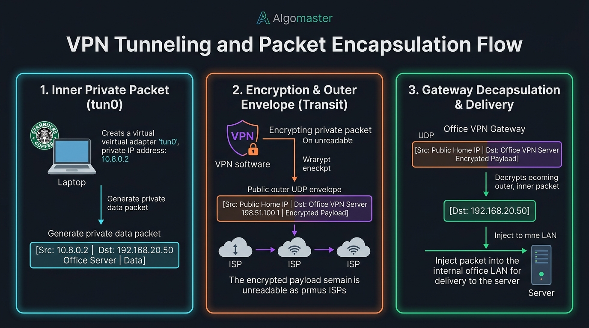

# 🛡️ Step 6: VPNs (Virtual Private Networks) & Packet Tunneling

> **Phase 2: Networking — On The Wire**  
> *"A VPN turns the entire hostile global internet into a private, encrypted extension cord back to your corporate network."*

---

## 1. What is a VPN? (The Problem It Solves)

Imagine you are sitting in a Starbucks using public Wi-Fi. You need to access an internal company file server:
- Server IP: `192.168.20.50` (Private RFC-1918 IP)
- That IP has **no public internet route**. It is locked inside the office building behind a firewall.
- Furthermore, the Starbucks Wi-Fi is completely untrusted; hackers on the same network could sniff unencrypted packets.

A **VPN (Virtual Private Network)** solves both problems simultaneously:
1. **Confidentiality:** It encrypts all traffic leaving your laptop using strong ciphers (AES or ChaCha20).
2. **Virtual Presence:** It assigns your laptop an **internal corporate IP address**, making the remote server believe your laptop is physically plugged into the office switch!

---

## 2. Under the Hood: The Virtual Adapter (`tun0`)

When you run a VPN client (like WireGuard or OpenVPN) on Linux or Windows, it creates a **Virtual Network Interface**:

```text
Laptop Network Interfaces:
┌─────────────────────────┐
│ wlan0 (Physical Wi-Fi)  │ ──► Connected to Starbucks Router (172.16.0.45)
├─────────────────────────┤
│ tun0  (Virtual Adapter) │ ──► Assigned Corporate VPN IP     (10.8.0.2)
└─────────────────────────┘
```

- When you try to connect to `192.168.20.50`, your operating system routes the packet into **`tun0`**.
- The VPN background software reads that packet, encrypts it, wraps it inside an outer envelope, and transmits it out of **`wlan0`**.

---

## 3. The VPN Encapsulation Flow (Packet Inside a Packet)

Here is the exact journey of a packet traveling through a VPN tunnel:



### The 3-Step Journey:

1. **Card 1 — Inner Private Packet (`tun0`):**  
   Your browser wants internal company data. Your OS generates a standard private packet:
   $$\text{[ Src IP: 10.8.0.2 } \longrightarrow \text{ Dst IP: 192.168.20.50 } \mid \text{ Payload: GET /payroll ]}$$
   This is the **Inner Packet**.

2. **Card 2 — Encryption & Outer Envelope (Public Transit):**  
   The VPN software takes the entire Inner Packet and **encrypts it**.  
   It then places the encrypted blob inside a brand-new **Outer UDP Packet**:
   $$\text{[ Src IP: 172.16.0.45 (Starbucks) } \longrightarrow \text{ Dst IP: 198.51.100.1 (Office Gateway) } \mid \mathbf{Encrypted\ Blob} \text{ ]}$$
   - Starbucks Wi-Fi, local eavesdroppers, and ISPs can only see random scrambled bytes traveling to port `51820` or `1194`.
   - Nobody in transit knows you are visiting `192.168.20.50` or requesting payroll data!

3. **Card 3 — Gateway Decapsulation & Delivery:**  
   The Office VPN Gateway receives the outer UDP packet:
   - It verifies the cryptographic key and **decrypts the payload**.
   - Out pops the original **Inner Packet** (`Dst: 192.168.20.50`).
   - The Gateway injects this packet directly onto the internal office LAN cable.
   - The server replies back to `10.8.0.2`. The Gateway encrypts the reply and beams it back to your laptop.

---

## 4. Modern VPN Protocols at a Glance

| Protocol | Default Port & Transport | Cryptography | Characteristics |
| :--- | :--- | :--- | :--- |
| **WireGuard** | Port **51820 / UDP** | ChaCha20-Poly1305, Curve25519 | Ultra-fast, lightweight (~4,000 lines of kernel code), modern standard. |
| **OpenVPN** | Port **1194 / UDP** (or 443 / TCP) | OpenSSL (AES-256-GCM, RSA/ECDSA) | Highly customizable, can mimic HTTPS on TCP 443 to bypass restrictive firewalls. |
| **IPsec / IKEv2**| Port **500 & 4500 / UDP** | AES-GCM, SHA-2 | Heavyweight, traditional standard for permanent Site-to-Site office interconnects. |

---

## 5. 🔴 Offensive & Red Teaming Perspective

### A. Split Tunneling as a Pivoting Vector
- **Full Tunnel:** *All* traffic (corporate intranet AND browsing YouTube) is forced through the encrypted tunnel.
- **Split Tunnel:** Only corporate IPs (`192.168.x.x`) go through the tunnel; regular web browsing goes straight through Starbucks Wi-Fi.
- **The Red Team Risk:** If a user on a split tunnel gets infected via a malicious website or phishing link, the attacker has a foothold on a machine with an active, uninspected leg directly inside the corporate network! The attacker uses the infected laptop as a **Pivot Host**.

### B. VPN Gateways as Initial Access Targets
VPN gateways are directly exposed to the public internet on ports 443 or 51820. If an organization lacks Multi-Factor Authentication (MFA), password spraying or leaked credentials from a credential dump can grant an external attacker a direct IP inside the internal corporate network in seconds.
