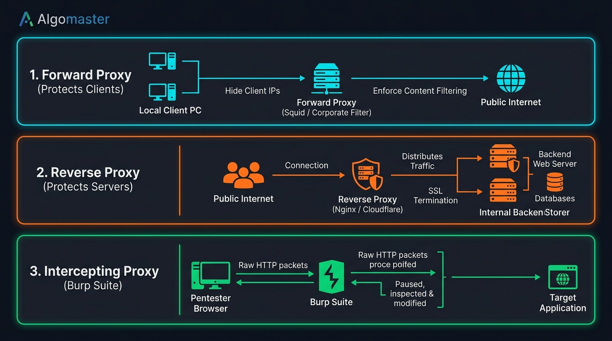

# 🛡️ Step 7: Firewalls, Proxies & Traffic Control

> **Phase 2: Networking — On The Wire**  
> *"Firewalls decide IF traffic can pass; Proxies decide HOW traffic is handled and whom it represents."*

---

## 1. Firewalls: The Gatekeepers

A **Firewall** monitors and filters incoming and outgoing network packets based on security rules.

### The 3 Core Classes:
1. **Stateless Packet Filter (Layer 3 & 4):**
   - Inspects individual packets in isolation: `[Src IP, Dst IP, Protocol, Port]`.
   - Has zero memory. Cannot correlate replies to requests.
2. **Stateful Packet Inspection (SPI) (Layer 4):**
   - Maintains a **connection state table** in memory.
   - When a host initiates an outbound request, the return response is automatically recognized as `ESTABLISHED,RELATED` and allowed back in.
   - Unsolicited outside scans are dropped immediately.
3. **Web Application Firewall (WAF) (Layer 7):**
   - Decodes HTTP/HTTPS payloads to detect attack strings (e.g., SQL Injection `' OR 1=1--`, Cross-Site Scripting `<script>`).

---

## 2. Linux Kernel Firewalls (`iptables`)

Linux filters packets through three default **Chains**:

```text
Incoming Packet
       │
       ▼
 [ Is it for this host? ]
       │                │
      YES               NO
       │                │
       ▼                ▼
[ INPUT Chain ]   [ FORWARD Chain ] (Routed through to another interface/VM)
       │
       ▼
Local Application (e.g. SSH, Web server)
       │
       ▼
[ OUTPUT Chain ] ──► Leaving the host
```

### The Recon Difference: `DROP` vs. `REJECT`

| Rule Action | Firewall Behavior | What Nmap / Attacker Sees | Security Implication |
| :--- | :--- | :--- | :--- |
| **`DROP`** | Silently deletes the packet. Sends **nothing** back. | **`FILTERED`** (Scan hangs / times out) | Forces attackers into slow scan rates; reveals no information. |
| **`REJECT`** | Drops the packet, but sends back an ICMP unreachable or TCP `RST`. | **`CLOSED`** (Immediate reset) | Friendly for legitimate internal users, but confirms the host is live to attackers. |

---

## 3. Proxies: Forward, Reverse & Intercepting

A **Proxy Server** acts as an intermediary for requests between clients and servers.



### Comparison of the 3 Core Proxy Types:

### A. Forward Proxy (Protects & Hides the Client)
- **Where it sits:** In front of the internal client devices.
- **How it works:** When an employee visits the web, the request goes to the Forward Proxy. The proxy fetches the webpage using **its own IP** and gives it back to the employee.
- **Use Cases:**
  - Hides internal client IP addresses from the internet.
  - Enforces corporate content filtering (blocks gambling, social media, malware domains).
  - Caches popular web pages to save bandwidth.
- **Examples:** Squid, BlueCoat, Zscaler.

### B. Reverse Proxy (Protects & Hides the Server)
- **Where it sits:** In front of internal backend servers.
- **How it works:** When public internet users visit `https://company.com`, they connect to the Reverse Proxy. The proxy forwards the request to backend microservices or databases, receives the response, and returns it to the user.
- **Use Cases:**
  - **Hides backend infrastructure:** Public users never know the true internal IP of the backend database or application server.
  - **Load Balancing:** Distributes millions of requests across clusters of servers.
  - **SSL Termination:** Decrypts incoming HTTPS traffic in one central place so backend servers can run plain HTTP.
  - **DDoS Mitigation:** Absorbs and blocks volumetric attacks before they hit the database.
- **Examples:** Nginx, HAProxy, Cloudflare, AWS ALB.

### C. Intercepting Proxy (The Penetration Tester’s Weapon)
- **Where it sits:** Between the security tester's browser and the target web application.
- **How it works:** Every HTTP/HTTPS request is caught in mid-air. The tester can pause, inspect, rewrite parameters (e.g. changing `price=100` to `price=1`), and forward the modified request.
- **Primary Tool:** **Burp Suite** (and OWASP ZAP).

---

## 4. 🔴 Red Teaming & Pivoting: SOCKS Proxies & `proxychains`

In offensive security, once an attacker compromises an internal dual-homed machine (connected to both the internet and a private internal subnet), they turn that compromised machine into a **SOCKS Proxy**:

```bash
# Red team tool on attacker laptop routes all terminal commands through the compromised host:
proxychains nmap -sT -Pn 10.10.10.50
```

`proxychains` hooks network system calls, wrapping packets and tunneling them through the proxy to attack internal hosts that have no direct route to the internet!
