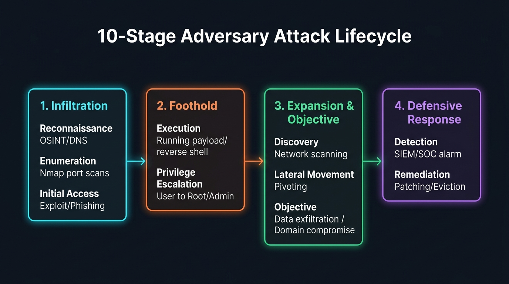

# ⚔️ Step 7: The Adversary Attack Lifecycle

> **Phase 3: Cybersecurity Fundamentals**  
> *"Amateurs hack systems; professionals execute campaigns across an attack lifecycle."*

---

## 1. The 10-Stage Cyber Attack Lifecycle

In real-world red teaming and cyber warfare, an intrusion is not a single lucky event. It is a structured sequence of 10 progressive phases:

---

## 2. Phase-by-Phase Breakdown

### Block 1: Infiltration (Finding & Forcing the Door)

1. **Reconnaissance (Passive):**
   - Gathering intelligence without directly touching the target's servers.
   - Searching employee emails on LinkedIn, analyzing public DNS records (`dig`), and scanning certificate transparency logs.
2. **Enumeration (Active):**
   - Actively probing the target's digital perimeter.
   - Running **Nmap** port scans, identifying open ports (`22`, `80`, `445`), web directories, and service versions.
3. **Initial Access:**
   - Breaching the perimeter to get a first foot in the door.
   - Examples: Exploiting an unpatched web vulnerability, sending a spear-phishing payload, or password spraying.

---

### Block 2: Foothold & Escalation (Gaining Control)

4. **Execution:**
   - Running attacker code on the target machine.
   - Spawning a **Reverse Shell** connecting back to a Netcat / command-and-control (C2) listener.
5. **Privilege Escalation:**
   - Moving from a low-privilege service account (e.g., `www-data` on Linux or a standard user on Windows) up to **`root`** or **`SYSTEM` / Domain Admin**.
   - Examples: Abusing Linux SUID binaries, misconfigured sudo rules, or unquoted service paths.

---

### Block 3: Expansion & Objective (The Goal)

6. **Discovery:**
   - Looking around the compromised machine and the internal corporate LAN.
   - Inspecting network routes, finding internal database IPs, and scanning the Active Directory domain controller.
7. **Lateral Movement:**
   - Jumping from the initially compromised workstation to other servers on the network.
   - Using tools like `proxychains` or techniques like Pass-the-Hash and SSH key harvesting.
8. **Objective (Actions on Objectives):**
   - Completing the ultimate mission goal:
     - Red Team: Proving control over the Domain Controller or accessing crown-jewel customer data.
     - Malicious Actor: Exfiltrating confidential IP or deploying ransomware.

---

### Block 4: Defensive Response (Catching & Evicting)

9. **Detection:**
   - Defensive analysts in the SOC spot anomalous behavior in the **SIEM** or EDR (e.g. unexpected PowerShell execution, mass file access).
10. **Remediation:**
    - Incident responders sever infected network links, revoke compromised tokens, apply vendor security patches, and restore from backups.
